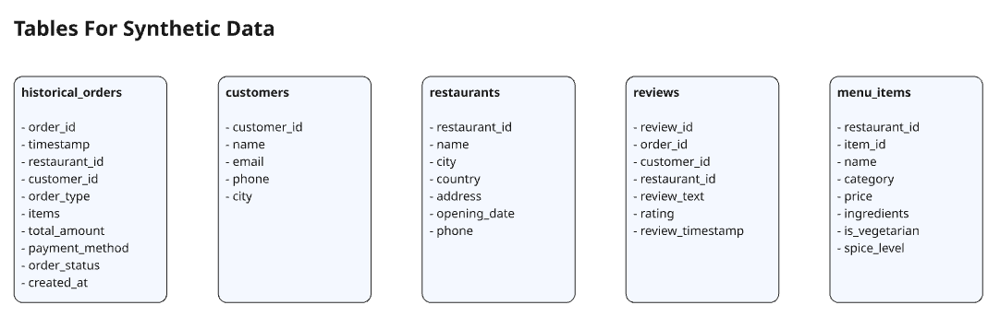
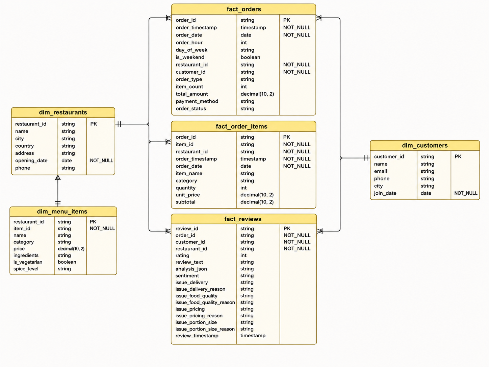

# 🍽️ Restaurant Data Pipeline (Azure + Databricks)


> A production-grade, end-to-end data engineering and analytics pipeline for a multi-city restaurant chain, built on Azure and Databricks. The pipeline ingests real-time order events from **Azure Event Hubs** and batch operational data from **Azure SQL** via **Databricks Lakeflow Connect** (CDC-enabled), processes them through a full **Medallion Architecture** (Bronze → Silver → Gold) using **Spark Declarative Pipelines**, and delivers rich Gold tables - including AI-powered review sentiment analysis via **Mosaic AI** (`ai_query`) - all governed through **Unity Catalog**.

---

## Table of Contents

- [Introduction](#introduction)
- [Architecture](#architecture)
- [Source Setup](#source-setup)
  - [Synthetic Data Generation](#synthetic-data-generation)
  - [Azure SQL Database Setup](#azure-sql-database-setup)
  - [Azure Event Hub Setup](#azure-event-hub-setup)
  - [Connecting with DataGrip](#connecting-with-datagrip)
- [Azure & Databricks Configuration](#azure--databricks-configuration)
  - [Resource Groups](#resource-groups)
  - [Azure Databricks Workspace](#azure-databricks-workspace)
  - [Custom Cluster Policy: Minimal Compute](#custom-cluster-policy-minimal-compute)
  - [Lakeflow Connect & Unity Catalog Schemas](#lakeflow-connect--unity-catalog-schemas)
- [Pipeline Deep Dive](#pipeline-deep-dive)
  - [1. Bronze - Event Hub Streaming (Spark Declarative Pipeline)](#1-bronze---event-hub-streaming-spark-declarative-pipeline)
  - [2. Bronze - SQL Ingestion via Lakeflow Connect (CDC)](#2-bronze---sql-ingestion-via-lakeflow-connect-cdc)
  - [3. Silver - Transformations & Data Quality](#3-silver---transformations--data-quality)
  - [4. Gold - Aggregated Serving Layer & Mosaic AI](#4-gold---aggregated-serving-layer--mosaic-ai)
- [Data Model](#data-model)
- [Key Engineering Decisions](#key-engineering-decisions)

---

## Introduction

This project builds a real-world lakehouse pipeline for a restaurant chain operating across multiple cities. Two distinct source systems feed data into the lakehouse:

- **Azure Event Hubs** - a Python script (`04_eventhub_orders.py`) continuously streams live orders as JSON events, simulating a real POS system publishing order events in real time.
- **Azure SQL Database** - holds the operational tables: `customers`, `restaurants`, `menu_items`, `historical_orders`, and `reviews`. These are ingested into the lakehouse using **Databricks Lakeflow Connect** with both **Change Tracking** and **CDC (Change Data Capture)** enabled.

The pipeline handles:

- **Real-time streaming** of live orders from Azure Event Hubs into the Bronze layer via Spark Declarative Pipelines
- **CDC-based batch ingestion** from Azure SQL into Bronze via Lakeflow Connect, picking up inserts and updates automatically
- **Declarative Silver transformations** with `@dp.expect_all_or_drop` data quality constraints, JSON exploding, and temporal enrichment
- **Gold materialized views** computing customer 360 profiles, daily sales summaries, and restaurant review aggregations
- **Mosaic AI integration** via `ai_query('databricks-gpt-oss-20b', ...)` in a SQL Streaming Table to perform sentiment analysis and issue classification on raw review text
- **Full Unity Catalog governance** with all tables registered under a workspace-scoped catalog

---

## Architecture


Data originates from two sources: **Azure Event Hubs** (live streaming orders) and **Azure SQL Database** (batch operational tables). Event Hub data is ingested via a **Spark Declarative Pipeline** using the Kafka-compatible API. SQL data is ingested via **Databricks Lakeflow Connect** with CDC enabled. All data flows through a **Medallion Architecture** (Bronze → Silver → Gold) managed as Spark Declarative Pipelines, with **Unity Catalog** and **Databricks SQL** providing governance and serving throughout.

---

## Source Setup

### Synthetic Data Generation

Before the pipeline runs, all source data is generated synthetically using Python scripts in `00_synthetic_data/`. The scripts are run in order and produce CSV files in `00_synthetic_data/data/` which are then loaded into Azure SQL.



| Script | What It Generates |
|---|---|
| `00_sql_db.py` | `restaurants.csv`, `customers.csv`, `menu_items.csv` - master data for all restaurants, 500+ customers, full menu catalogue |
| `01_historical_orders.py` | `historical_orders.csv` - 8,000 completed orders over the past 6 months with realistic time distribution (peak hours, weekends) |
| `02_reviews.py` | `customer_reviews.csv` - reviews generated for ~35% of historical orders, with rating distribution skewed toward 4–5 stars |
| `04_eventhub_orders.py` | Live order events published to Azure Event Hub in real time (runs indefinitely, one order every 3 seconds) |

`requirements.txt` in `00_synthetic_data/` pins all dependencies:

```
azure-eventhub==5.15.1
pandas==2.3.3
faker==39.0.0
python-dotenv==1.2.1
```

Event Hub credentials are loaded from a `.env` file via `python-dotenv` so no secrets appear in source code:

```python
EVENTHUB_CONNECTION_STRING = os.getenv("EVENTHUB_CONNECTION_STRING")
EVENTHUB_NAME = os.getenv("EVENTHUB_NAME")
```

---

### Azure SQL Database Setup

The SQL setup is handled by two files in `00_synthetic_data/sql/`:

**`azuresqldatabase_setup.sql`** - Creates all five source tables and enables both Change Tracking and CDC on each:

```sql
-- Table DDL (repeat for all 5 tables)
CREATE TABLE SCHEMA_NAME.customers (
    customer_id VARCHAR(256) PRIMARY KEY,
    name VARCHAR(256), email VARCHAR(256),
    phone VARCHAR(256), city VARCHAR(256), join_date DATE
);

-- Enable database-level Change Tracking
ALTER DATABASE DB_NAME SET CHANGE_TRACKING = ON (CHANGE_RETENTION = 14 DAYS, AUTO_CLEANUP = ON);

-- Enable table-level Change Tracking (for Lakeflow Connect)
ALTER TABLE dbo.customers ENABLE CHANGE_TRACKING;
ALTER TABLE dbo.historical_orders ENABLE CHANGE_TRACKING;
ALTER TABLE dbo.menu_items ENABLE CHANGE_TRACKING;
ALTER TABLE dbo.restaurants ENABLE CHANGE_TRACKING;
ALTER TABLE dbo.reviews ENABLE CHANGE_TRACKING;

-- Enable CDC on the database
EXEC sys.sp_cdc_enable_db;

-- Enable CDC per table (Lakeflow uses CDC capture instances internally)
EXEC sys.sp_cdc_enable_table @source_schema = N'dbo', @source_name = N'customers', @role_name = NULL;
-- ... repeat for all 5 tables

-- Grant Lakeflow Connect user all required permissions
EXEC dbo.lakeflowFixPermissions @User = 'databrickse2eprojUserAdmin', @Tables = 'ALL';
EXEC dbo.lakeflowSetupChangeTracking @Tables = 'ALL', @User = 'your_user';
EXEC dbo.lakeflowSetupChangeDataCapture @Tables = 'ALL', @User = 'your_password';
```

**`utility_script.sql`** - The official Databricks Lakeflow Connect v1.1 utility script (sourced from [Databricks docs](https://docs.databricks.com/aws/en/ingestion/lakeflow-connect/sql-server-utility)). Running this installs three stored procedures into the database:

- `lakeflowFixPermissions` - grants the ingestion user all SELECT, EXECUTE, and VIEW permissions needed across system views and CDC objects
- `lakeflowSetupChangeTracking` - enables Change Tracking at database and table level with DDL audit objects
- `lakeflowSetupChangeDataCapture` - enables CDC and manages capture instance lifecycle (toggles between `_1` and `_2` suffixes to handle schema changes)

**Why both Change Tracking and CDC?** Lakeflow Connect uses Change Tracking as its primary incremental mechanism (lightweight, row-level version numbers). CDC is enabled additionally because it captures the full before/after image of changed rows, which is required for certain table types and gives Lakeflow more metadata to work with during schema evolution.

**Simulating CDC Changes** - After the initial load, incremental changes were tested using:

```sql
-- Update: city change triggers a CDC event on 'customers'
UPDATE customers SET city='Abu Dhabi' WHERE customer_id='CUST-10000';

-- Insert: new menu item triggers a CDC event on 'menu_items'
INSERT INTO dbo.menu_items (restaurant_id, item_id, name, category, price, ingredients, is_vegetarian, spice_level)
VALUES ('REST-AUH-001','ITEM-999','Samosa (2 pcs)','Starter',18.49,'Potato, Peas, Spices, Pastry',1,'Medium');
```

---

### Azure Event Hub Setup

An **Azure Event Hub** namespace is provisioned to act as the real-time ingestion layer for live orders. Event Hub was chosen over alternatives (e.g. Azure Service Bus) specifically because it exposes a **Kafka-compatible endpoint** - this means Databricks can read from it using the standard Kafka source format without any custom connector, making the Spark Declarative Pipeline for order streaming both simple and portable.

The producer script (`04_eventhub_orders.py`) sends one order every 3 seconds:

```python
producer = EventHubProducerClient.from_connection_string(
    conn_str=EVENTHUB_CONNECTION_STRING, eventhub_name=EVENTHUB_NAME
)
event_data_batch = producer.create_batch()
event_data_batch.add(EventData(json.dumps(order)))
producer.send_batch(event_data_batch)
time.sleep(3)
```

Each order JSON contains the full payload - order metadata, a nested `items` array, and order status.

---

### Connecting with DataGrip

**DataGrip** (JetBrains) was used throughout the project to inspect and query the Azure SQL Database directly - useful for verifying CDC setup, checking Change Tracking version numbers, and running ad-hoc validation queries before pipeline runs.

To connect DataGrip to Azure SQL:

1. Open DataGrip → **New Data Source** → **Microsoft SQL Server**
2. Set **Host** to your Azure SQL server: `<server-name>.database.windows.net`
3. Set **Port** to `1433`, **Database** to your DB name
4. Set **Authentication** to `User & Password`, enter the SQL admin credentials
5. Under **Advanced**, ensure `encrypt=true` and `trustServerCertificate=false` (Azure SQL requires SSL)
6. Click **Test Connection** → if successful, click **OK**

---

## Azure & Databricks Configuration

### Resource Groups

All Azure resources are organized under a single **Resource Group** for lifecycle management and cost tracking. Resources provisioned:

- Azure SQL Server + Database (General Purpose tier, with CDC and Change Tracking enabled)
- Azure Event Hub Namespace + Event Hub instance
- Azure Databricks Workspace (Premium tier - required for Unity Catalog)
- Azure Key Vault (for storing Event Hub connection strings as Databricks secrets)

### Azure Databricks Workspace

The workspace is **Premium tier** - this is a hard requirement for Unity Catalog. After provisioning:

1. A **Unity Catalog Metastore** was attached to the workspace
2. A workspace-scoped **catalog** (`ws_dbxproject_7405606677876678`) was created as the top-level namespace
3. Four schemas were created inside this catalog:
   - `00_landing` - Lakeflow Connect gateway staging area
   - `01_bronze` - raw ingested tables (orders, historical_orders, customers, restaurants, menu_items, reviews)
   - `02_silver` - cleaned and enriched tables
   - `03_gold` - serving-layer aggregated views

### Custom Cluster Policy: Minimal Compute

A **custom cluster policy** named `Minimal Compute` was created and applied specifically to the **Lakeflow Connect Ingestion Gateway Pipeline**. Without this policy, the gateway pipeline defaults to a larger cluster, making CDC ingestion unnecessarily expensive for a development/test workload.

The policy was applied via the Databricks CLI after the gateway pipeline was created, since the UI does not expose policy selection for Lakeflow pipelines directly:

```bash
# Step 1: Find the gateway pipeline ID
databricks pipelines list-pipelines --output json

# Step 2: Patch the pipeline with the policy
databricks pipelines update 7ac1fd16-b92f-45d3-b0e2-a3330d0f3b73 --json '{
  "name": "gw_ingestion",
  "catalog": "ws_dbxproject_7405606677876678",
  "schema": "00_landing",
  "gateway_definition": {
    "connection_name": "conn_restaurantops",
    "gateway_storage_catalog": "ws_dbxproject_7405606677876678",
    "gateway_storage_schema": "00_landing",
    "gateway_storage_name": "gw_ingestion"
  },
  "clusters": [
    {
      "label": "default",
      "policy_id": "001FDEA0FF111B45",
      "apply_policy_default_values": true
    }
  ],
  "continuous": true
}'
```

**Why a custom policy?** The Lakeflow gateway runs continuously. Leaving it on an unconstrained cluster type burns DBUs unnecessarily. The `Minimal Compute` policy enforces a small single-node instance type with autoscaling disabled, keeping costs minimal while the gateway just polls for SQL changes.

---

### Lakeflow Connect & Unity Catalog Schemas

**Lakeflow Connect** is Databricks' native managed ingestion service. A **connection** (`conn_restaurantops`) was created inside the workspace pointing at the Azure SQL server. A **Lakeflow Ingestion Pipeline** was then configured on top of this connection, selecting all five tables and targeting the `01_bronze` schema. The pipeline runs continuously and uses Change Tracking to determine which rows changed since the last checkpoint.

The connection between CDC and Lakeflow: Lakeflow Connect uses the SQL Server Change Tracking version number as its low-watermark cursor. On each micro-batch, it queries `CHANGETABLE(CHANGES ..., @last_version)` to fetch only rows modified since the prior run. This is a lighter-weight alternative to a full ADF watermark strategy - no pipeline code to write, no watermark JSON to manage, and the cursor is durable inside the Lakeflow pipeline state.

---

## Pipeline Deep Dive

All pipelines in this project are implemented as **Spark Declarative Pipelines (SDP)** - the evolution of Databricks Delta Live Tables. Tables and views are defined as Python functions decorated with `@dp.table` or `@dp.materialized_view`, and the SDP runtime handles the execution order, incremental processing, checkpointing, and data quality enforcement.

### 1. Bronze - Event Hub Streaming (Spark Declarative Pipeline)

**File:** `01_pipelines/pipeline_ingest_eventhub.py`

This pipeline reads live order events from Event Hub using the Kafka-compatible API and writes them to `01_bronze.orders` as a streaming Bronze table.

**Why Kafka format for Event Hub?** Azure Event Hubs exposes a Kafka endpoint on port 9093. By using `spark.readStream.format("kafka")` with SASL/SSL authentication, the pipeline connects to Event Hub exactly as it would to any Kafka broker - no Azure-specific SDK needed. This makes the code fully portable.

```python
KAFKA_OPTIONS = {
    "kafka.bootstrap.servers": f"{EH_NAMESPACE}.servicebus.windows.net:9093",
    "subscribe": EH_NAME,
    "kafka.sasl.mechanism": "PLAIN",
    "kafka.security.protocol": "SASL_SSL",
    "kafka.sasl.jaas.config": f'kafkashaded.org.apache.kafka.common.security.plain.PlainLoginModule required username="$ConnectionString" password="{EH_CONN_STR}";',
    "maxOffsetsPerTrigger": "50000",
    "failOnDataLoss": "true",
    "startingOffsets": "earliest",
}

@dp.table(name="orders", table_properties={"quality": "bronze"})
def orders():
    df_raw = spark.readStream.format("kafka").options(**KAFKA_OPTIONS).load()
    df_parsed = (
        df_raw
        .withColumn("value_str", col("value").cast("string"))
        .withColumn("data", from_json("value_str", orders_schema))
        .select("data.*")
        .withColumnRenamed("timestamp", "order_timestamp")
    )
    return df_parsed
```

The Kafka `value` column arrives as raw bytes. It is cast to string, then parsed with `from_json` against a defined schema to produce a clean structured DataFrame. The SDP runtime checkpoints Kafka offsets, so the pipeline never reprocesses messages.

---

### 2. Bronze - SQL Ingestion via Lakeflow Connect (CDC)

This is not a code pipeline - it is a **managed Lakeflow Connect Ingestion Pipeline** configured through the Databricks UI and then patched via CLI. The pipeline reads from all five Azure SQL tables (`customers`, `restaurants`, `menu_items`, `historical_orders`, `reviews`) using Change Tracking and materialises them as Delta tables in `01_bronze`.

The gateway pipeline (`gw_ingestion`) runs continuously in the `00_landing` schema, acting as a staging buffer. The downstream ingestion pipeline then promotes data from landing into `01_bronze` as streaming tables, applying CDC semantics (inserts, updates, deletes).

**How CDC flows through Lakeflow:**

1. Lakeflow queries `CHANGETABLE(CHANGES <table>, <last_version>)` on Azure SQL
2. Changed rows arrive in the `00_landing` staging area with `_change_type` metadata (`INSERT`, `UPDATE`, `DELETE`)
3. The ingestion pipeline merges these into `01_bronze` Delta tables, maintaining the current state

After the initial load, CDC was verified by triggering changes in DataGrip and confirming they appeared in the Bronze tables within the next pipeline micro-batch.

---

### 3. Silver - Transformations & Data Quality

**Files:** `01_pipelines/pipeline_bronze_to_gold/silver/`

All Silver tables are defined as **streaming SDP tables** reading from Bronze using `dp.read_stream(...)`. Each table uses `@dp.expect_all_or_drop` to enforce data quality - rows violating any constraint are silently dropped rather than halting the pipeline.

#### `fact_orders` (Python SDP)

Reads from `01_bronze.orders` (the live Event Hub stream). Key transformations:

- Timestamps: `to_timestamp` → derive `order_date`, `order_hour`, `day_of_week`, `is_weekend`
- JSON exploding: the `items` column is a JSON array string; `from_json` parses it into a struct array, then `size()` gives `item_count`
- Data quality constraints enforce non-null keys, valid `order_status` values, valid `payment_method`, and `total_amount > 0`

```python
@dp.table(name="02_silver.fact_orders")
@dp.expect_all_or_drop({
    "valid_order_id": "order_id IS NOT NULL",
    "valid_amount": "total_amount > 0",
    "valid_order_status": "order_status IN ('completed', 'pending', 'ready', 'delivered', 'preparing', 'confirmed')",
    "valid_payment_method": "payment_method IN ('cash', 'card', 'wallet')",
    ...
})
def fact_orders():
    return (
        dp.read_stream("01_bronze.orders")
        .withColumn("order_timestamp", F.to_timestamp(F.col("order_timestamp")))
        .withColumn("order_date", F.to_date(F.col("order_timestamp")))
        .withColumn("order_hour", F.hour(F.col("order_timestamp")))
        .withColumn("day_of_week", F.date_format(F.col("order_timestamp"), "EEEE"))
        .withColumn("is_weekend", F.when(F.date_format(...).isin(["Sat", "Sun"]), True).otherwise(False))
        .withColumn("items_parsed", F.from_json(F.col("items"), items_schema))
        .withColumn("item_count", F.size(F.col("items_parsed")))
        ...
    )
```

#### `fact_order_items` (Python SDP)

Also reads from `01_bronze.orders`, but explodes the nested `items` array into individual line-item rows using `F.explode()`. Each output row represents one item in one order - enabling item-level analytics like best-seller rankings and category revenue breakdown.

```python
.withColumn("items_parsed", F.from_json(F.col("items"), items_schema))
.withColumn("item", F.explode(F.col("items_parsed")))
.select("order_id", F.col("item.item_id"), F.col("item.name"), F.col("item.quantity"), ...)
```

#### `fact_reviews` (SQL Streaming Table - Mosaic AI)

This is where **Mosaic AI** enters the pipeline. Reviews arrive in Bronze as raw text. In the Silver layer, `fact_reviews` is defined as a **SQL Streaming Table** that calls `ai_query()` inline during the streaming transformation to classify each review:

```sql
CREATE OR REFRESH STREAMING TABLE `02_silver`.fact_reviews (
  CONSTRAINT valid_sentiment EXPECT (sentiment IN ('positive', 'neutral', 'negative')) ON VIOLATION DROP ROW,
  CONSTRAINT non_negative_rating EXPECT (rating >= 0) ON VIOLATION DROP ROW
)
AS SELECT
  review_id, order_id, customer_id, restaurant_id, rating, review_text, analysis_json,
  get_json_object(analysis_json, '$.sentiment') AS sentiment,
  get_json_object(analysis_json, '$.issue_delivery') AS issue_delivery,
  get_json_object(analysis_json, '$.issue_food_quality') AS issue_food_quality,
  get_json_object(analysis_json, '$.issue_pricing') AS issue_pricing,
  get_json_object(analysis_json, '$.issue_portion_size') AS issue_portion_size,
  ...
FROM (
  SELECT *, ai_query(
    'databricks-gpt-oss-20b',
    CONCAT(
      'Analyze the following review and return ONLY a valid JSON object with this exact structure: ',
      '{"sentiment": "<positive/neutral/negative>", "issue_delivery": <true/false>, ...}. ',
      'Review text: ', review_text
    )
  ) AS analysis_json
  FROM STREAM(`ws_testproj`.`01_bronze`.reviews)
);
```

`ai_query` calls the **Mosaic AI Foundation Models API** (`databricks-gpt-oss-20b`, an open-source GPT model served by Databricks) inline within the SQL streaming query. Each review row is sent to the model, which returns a structured JSON with:
- `sentiment`: `positive`, `neutral`, or `negative`
- `issue_delivery`, `issue_food_quality`, `issue_pricing`, `issue_portion_size`: boolean flags
- Corresponding reason strings explaining each flagged issue

The `analysis_json` raw response is stored alongside the parsed fields. Constraints then enforce that sentiment is one of the three valid values and rating is non-negative - bad model outputs are dropped rather than poisoning the Gold layer.

#### Dimension Tables (SQL Streaming Tables)

`dim_customers`, `dim_restaurants`, and `dim_menu_items` are straightforward streaming reads from their respective Bronze tables into Silver, with schema enforcement and `_ingestion_timestamp` added.

---

### 4. Gold - Aggregated Serving Layer & Mosaic AI

**Files:** `01_pipelines/pipeline_bronze_to_gold/gold/`

Gold tables are defined as **`@dp.materialized_view`** - they are recomputed on each pipeline refresh, reading from Silver. There are three Gold tables:

#### `d_sales_summary` - Daily Revenue Aggregation

Groups `02_silver.fact_orders` by `order_date` to produce a daily snapshot for the operational dashboard. Partitioned on `order_date` for query efficiency.

```python
@dp.materialized_view(name="03_gold.d_sales_summary", partition_cols=["order_date"])
def d_sales_summary():
    return (
        dp.read("02_silver.fact_orders")
        .groupBy("order_date")
        .agg(
            F.countDistinct("order_id").alias("total_orders"),
            F.sum("total_amount").alias("total_revenue"),
            F.avg("total_amount").alias("avg_order_value"),
            F.countDistinct("customer_id").alias("unique_customers"),
            F.countDistinct("restaurant_id").alias("unique_restaurants"),
            F.sum(F.when(F.col("order_type") == "dine_in", 1).otherwise(0)).alias("dine_in_orders"),
            F.sum(F.when(F.col("order_type") == "takeaway", 1).otherwise(0)).alias("takeaway_orders"),
            F.sum(F.when(F.col("order_type") == "delivery", 1).otherwise(0)).alias("delivery_orders"),
        )
    )
```

#### `d_customer_360` - Full Customer Profile

Joins `dim_customers`, `fact_orders`, `fact_order_items`, and `fact_reviews` to build a comprehensive profile per customer. Uses `Window` functions to determine each customer's favourite restaurant and favourite menu item by order frequency.

Key computed columns:
- `loyalty_tier` - derived from `lifetime_spend` (Bronze < Silver < Gold < Platinum)
- `is_vip` - `True` if `lifetime_spend >= 5000`
- `favorite_restaurant` - restaurant with the most orders by this customer (Window rank)
- `favorite_item` - item with the highest total quantity ordered (Window rank)
- `avg_rating_given`, `total_reviews` - from Silver review stats

```python
.select(
    ...
    F.when(F.col("lifetime_spend") >= 5000, "Platinum")
     .when(F.col("lifetime_spend") >= 2000, "Gold")
     .when(F.col("lifetime_spend") >= 500, "Silver")
     .otherwise("Bronze").alias("loyalty_tier"),
    F.when(F.col("lifetime_spend") >= 5000, True).otherwise(False).alias("is_vip")
)
```

The SDP event log can be queried to inspect planning and flow progress for this table:

```sql
SELECT timestamp, details:flow_definition.output_dataset, details:flow_progress.status
FROM event_log(TABLE(`03_gold`.d_customer_360))
WHERE details:planning_information IS NOT NULL
ORDER BY timestamp DESC LIMIT 10;
```

#### `d_restaurant_reviews` - Review Aggregation with AI Sentiment

Joins `01_bronze.restaurants` with `02_silver.fact_reviews` (which already contains the AI-classified sentiment) to produce a per-restaurant review summary:

- Rating distribution (1–5 star counts)
- Sentiment counts (positive/neutral/negative) - powered by the upstream `ai_query` in Silver
- `avg_rating` rounded to 2 decimal places

This table is the data source for the **Review Insights Dashboard**, where stakeholders can drill into any restaurant and see its sentiment trend over time, issue categorisation breakdown, and individual review feed.

---

## Data Model



The Star Schema in the Silver layer consists of:

**Fact Tables:**
- `fact_orders` - one row per order (from Event Hub streaming)
- `fact_order_items` - one row per item per order (exploded from `fact_orders`)
- `fact_reviews` - one row per review, AI-enriched with sentiment and issue flags

**Dimension Tables:**
- `dim_customers` - customer master data
- `dim_restaurants` - restaurant master data
- `dim_menu_items` - full menu catalogue per restaurant

---

## Key Engineering Decisions

| Decision | Rationale |
|---|---|
| Azure Event Hub over Service Bus | Event Hub exposes a Kafka-compatible endpoint - Databricks reads it natively with `format("kafka")`, no custom connector needed |
| Lakeflow Connect over ADF for SQL ingestion | Managed CDC with durable cursors, no watermark JSON to maintain, no pipeline code - just point at the tables and let Databricks handle the rest |
| Both Change Tracking and CDC enabled | Change Tracking is Lakeflow's primary cursor mechanism; CDC is enabled additionally for full before/after row capture and schema evolution support |
| Custom `Minimal Compute` Policy for gateway | The Lakeflow gateway runs continuously; a constrained cluster policy avoids default over-provisioning and keeps DBU spend low |
| Spark Declarative Pipelines throughout | SDP handles execution ordering, checkpointing, incremental processing, and retry semantics declaratively - less imperative orchestration code to maintain |
| `@dp.expect_all_or_drop` on Silver tables | Bad rows are silently dropped rather than failing the pipeline - Gold layer stays clean without operator intervention on every bad event |
| SQL Streaming Table for `fact_reviews` | `ai_query` is a SQL function; defining `fact_reviews` as a SQL streaming table allows inline `ai_query` calls without switching languages |
| `ai_query('databricks-gpt-oss-20b', ...)` for sentiment | Mosaic AI Foundation Models are served within the Databricks platform - no external API calls, no API keys to rotate, billed with DBUs |
| Materialized Views for Gold | Gold tables are aggregations that should always reflect the latest Silver state; materialized views recompute on each refresh, keeping them current without managing incremental merge logic |
| Window functions for favourite restaurant/item | Row-number windows allow a single-pass rank rather than self-joins or subqueries, making the `d_customer_360` computation efficient at scale |
| Unity Catalog throughout | Every Bronze, Silver, and Gold table is registered in the Unity Catalog metastore - lineage, access control, and discoverability are first-class from day one |

---

<p align="center">
  Built by Prasun Dutta · Assisted by <a href="https://claude.ai">Claude</a>
</p>
